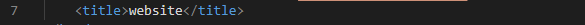
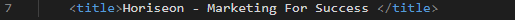
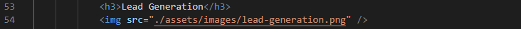
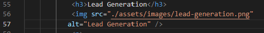
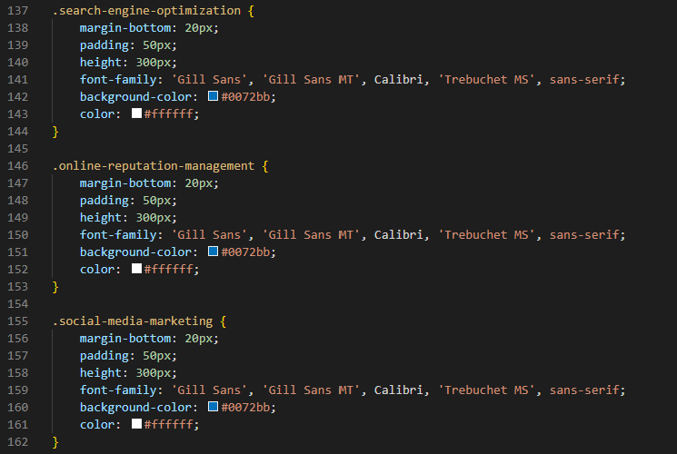
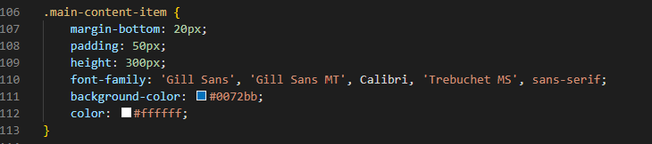
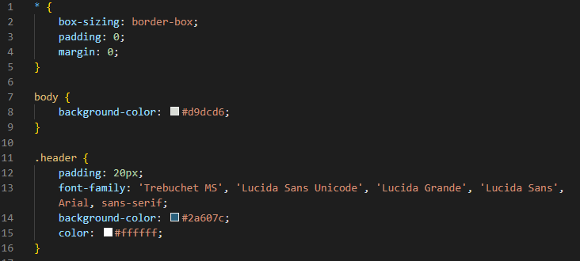

# Horiseon Inc. SEO Optimization

## Description

This project is aimed to optimize Horiseon Inc. website to increase web accessibility and improve search engine optimization (SEO).  The website code was refactored by including a descriptive title, incporating HTML semantic tags, and adding alt texts to images so that the website is more screen reader-friendly. The codes were also polished by adding comments and consolidating the commands.

## Examples of Work Performed

### Addition of a descriptive title

* **Original Code**

* **Optimized Code**

### Addition of alt text to images

* **Original Code**

* **Optimized Code**

### CSS code consolidation

* **Original Code**

* **Optimized Code**

### Developer-friendly CSS code comments

* **Original Code**

* **Optimized Code**

## Link to Work

[GitHub](https://github.com/xzhw39/edward-xu-mercury)

[Deployed Website](https://xzhw39.github.io/edward-xu-mercury/)

